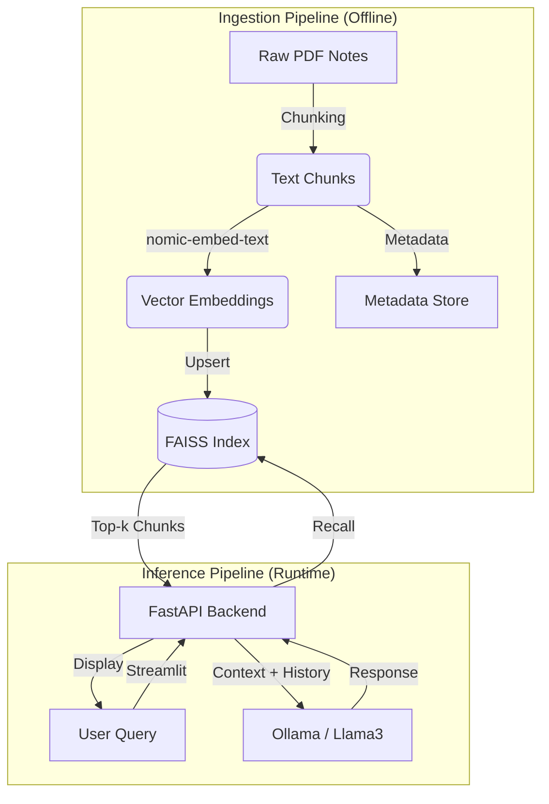

# NotesHelper

NotesHelper is a production-grade, local-first Retrieval-Augmented Generation (RAG) system designed to assist students in querying personal academic notes. Unlike generic chatbot interfaces, NotesHelper is architected for modularity, data privacy, and efficient resource usage on consumer hardware.

The system decouples data ingestion from inference, allowing for incremental updates to the knowledge base without full re-indexing. It leverages local Large Language Models (LLMs) and vector embeddings to ensure zero data exfiltration, making it suitable for sensitive or proprietary study materials.

## Key Features

* **Grounded Answers:** All answers provided by the LLM are grounded in the context from the provided study material, and generated answers are returned with the chunks that were retrieved to evaluate quality. 
* **Local-First Architecture:** Operates entirely offline using Ollama (Llama 3) for inference and Nomic for embeddings. No data is sent to external cloud providers.
* **Incremental Ingestion:** The ingestion pipeline tracks processed files. Adding new notes only processes the delta, significantly reducing embedding time and compute costs.
* **Multi-Subject Support:** Data is organized by subject (e.g., Operating Systems, Computer Networks), allowing for scoped retrieval that reduces noise in the context window.
* **Session-Based Memory:** The backend maintains conversational context per session, allowing users to ask follow-up questions (e.g., "Explain that further") while preserving state.
* **Decoupled Architecture:** The system is split into a discrete ingestion pipeline, a FastAPI inference server, and a Streamlit frontend, adhering to microservices principles.

## System Architecture

The architecture follows a standard RAG pattern but is optimized for local execution.


    

## Project Structure

The project follows a microservices-inspired directory structure to separate concerns between the data pipeline (Ingest), the API (Agent), and the Frontend (UI).

```text
noteshelper/
├── agent/                  # API & Inference Layer
│   ├── main.py             # FastAPI entry point (Orchestrator)
│   ├── memory.py           # Session-based sliding window memory
│   └── llm.py              # Ollama interaction logic
├── ingest/                 # Data Pipeline Layer
│   ├── ingest.py           # Main ETL script (Run this to index notes)
│   ├── chunking.py         # Logic to split PDFs into 500-token chunks
│   └── indexer.py          # FAISS index management (Add/Save/Load)
├── rag/                    # Retrieval Layer
│   ├── retriever.py        # Cosine similarity search logic
│   └── config.py           # Settings (e.g., Top-K=5, Chunk Size)
├── ui/                     # Frontend Layer
│   └── app.py              # Streamlit Chat Interface
├── notes/                  # Raw Data (PDFs)
│   ├── os/                 # Folder for Operating Systems notes
│   └── cn/                 # Folder for Computer Networks notes
├── data/                   # Artifact Storage
│   ├── faiss.index         # The actual vector database file
│   └── metadata.json       # Maps Vector IDs -> Text Content & Filenames
├── requirements.txt        # Python dependencies
└── README.md               # Documentation
```